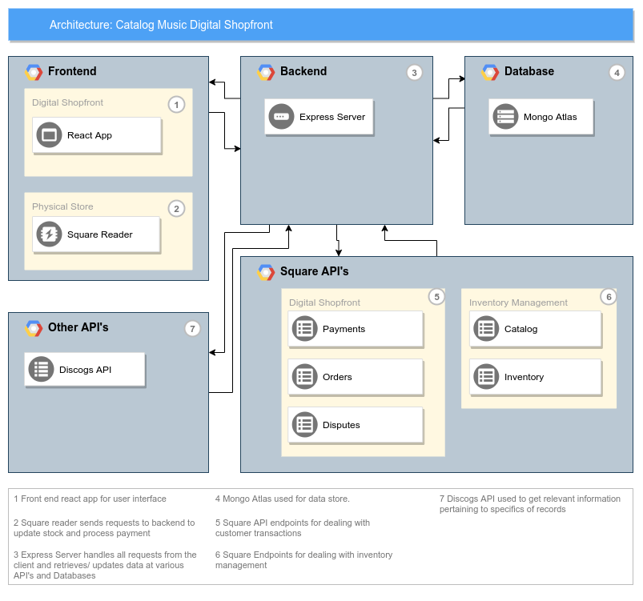
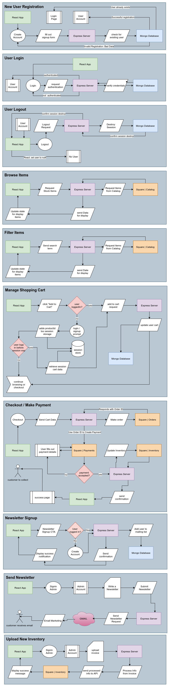

# Catalog Music Webshop

## MERN Capstone Project, developed by Daniel Keefer and Rob Dirken

---

### Overview ---

#### **[ Summary ]**

Our real world client for the application is Issac, Rob's friend. He has just started a record store and would like primarily to have an app that can serve as a digital shopfront and integrate with his Square account to manage customer orders and inventory.

#### **[ Features ]**

- Allow his customers to browse his stock online.
- Allow his customers to filter stock based on attributes.
- Allow his customers to place orders online.
- A cart interface, that allows customers to purchase multiple records at once.
- Keep his catalog and inventory synced with his physical stock.
- An opt in newsletter where Issac can send out information about new stock to his customer base.
- Ability to upload an invoice file and automagically update his inventory in Square.

#### **[ Target Audience ]**

There are two target Audiences, firstly an outward facing digital shopfront to expand his cliental to anyone that can reach his website. And Secondly the internal administration app for the business that will be aimed at Issac and his staff.

#### **[ Tech Stack ]**

- MongoDB
- Express.js
- React.js
- Node.js
- Mocha.js
- Chai.js
- Supertest.js
- Sinon.js
- Material UI
- Heroku
- Discogs API
- Square API
- Cloudinary

---

### Application Architecture Diagram ---

---

### Dataflow Diagram ---

---

### User Stories ---

#### **[ Users ]**

1. As a **User** I want to **add Items to a cart before I check out**, so that **I can order multiple items at once.**

2. As a **User** I want to **be able to browse through records**, so that **I can choose a record to purchase.**

3. As a **User** I want to **have a user experience that is both functional and interactive**, so that **I enjoy my time on the website.**

4. As a **User** I want to **be able to have an account**, so that **I can save my payment details for easier checkouts in the future.**

5. As a **User** I want to **be able to filter record searches based on specific parameters**, so that **I can narrow down my search.**

6. As a **User** I want to **be emailed an invoice after purchasing my items**, so that **I can have a record of the purchase.**

#### **[ Business Owner ]**

1. As a **Business Owner** I want to **make it easier for customers to share their purchases to their social media**, so that **I can attract more business by word of mouth.**

2. As a **Business Owner** I want to **be able to upload my suppliers invoice**, so that **I can automatically add new stock to my website.**

3. As a **Business Owner**, I want to **be able to send out a newsletter**, so that **I can let previous customers know about the new stock we have in.**

4. As a **Business Owner** I want to **be able to see all of the orders placed online**, So that **I can fulfil the order and have the stock ready for pickup or shipping.**

5. As a **Business Owner** I want to **have a website designed to reflect the style and ethos of my business**, so that **it aligns with and strengthens my business's branding.**

6. As a **Business Owner** I want to **have a section on the website where I can share more expertise and thoughts**, so that **customers can read my blog and be informed on the news I want to tell them.**

7. As a **Business Owner** I want to **have a section on the website that is a curated list of my stock**, so that **I can make recommendations on a broad scale to my customers.**

8. As a **Business Owner** I want to **be able to leave reviews on my on stock that are visible to my customers**, so that **customers can get a summary of the item based on my expert opinion.**

---

### Wireframes ---

---

### Devlog Screenshots ---
